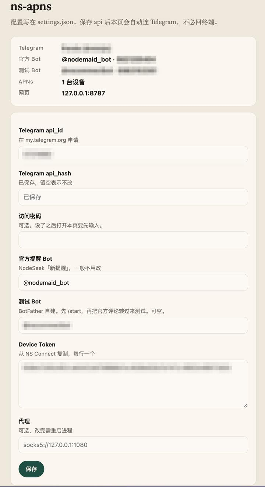

# ns-apns

监听 NodeSeek 官方 Telegram「新提醒」（`@nodemaid_bot`），解析后推到 NS Connect。

这不是 Bot。官方把消息推到**你的 Telegram 账号**，本程序登录同一个号去收。

## 准备工作

申请一对 Telegram 接口凭证：

1. 打开 [my.telegram.org/apps](https://my.telegram.org/apps)
2. 用已经绑定 NodeSeek「新提醒」的那个 Telegram 号登录
3. 新建应用，Platform 选 Desktop
4. 记下 `api_id` 和 `api_hash`，稍后填进设置页

这两项只标明「这是哪个程序」。不要发给别人；丢了再申请一对即可。

程序起来后，设置页默认是 [http://127.0.0.1:8787/](http://127.0.0.1:8787/)：



开机自启、Docker 等需求请自行处理。Device Token 只在设置页自己贴，不要发给 AI。

## 部署交给 AI

把装到服务器、拉起进程交给 AI，让它按这份文档做。扫码和 Token 你自己在设置页完成。

https://github.com/tyrad/ns-apns/blob/main/docs/deploy.md

可以对 AI 说：

```
请按 https://github.com/tyrad/ns-apns/blob/main/docs/deploy.md 帮我部署 ns-apns。
我已经申请好 Telegram 的 api_id 和 api_hash。
部署机器是：<SSH 用户@地址>
部署目录：<安装目录>
Device Token 我自己在设置页填，不要向我要 token。
```
